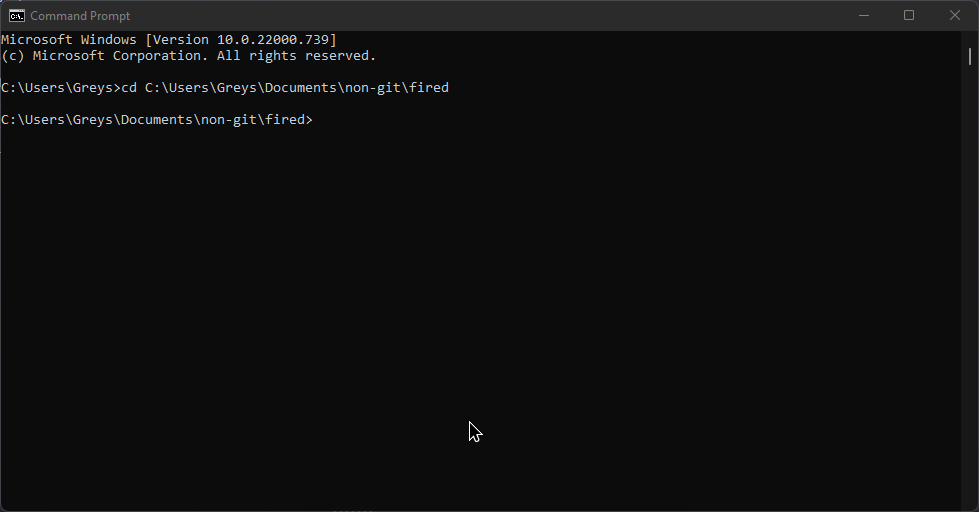
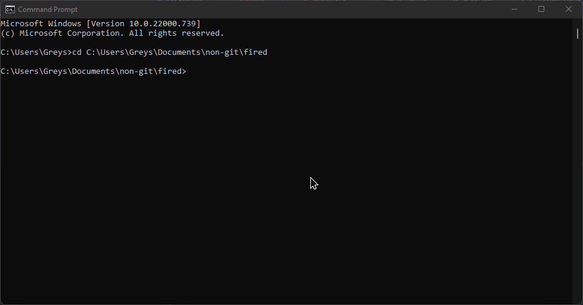

# Fired (Firefox Dumper) v0.1.1
Tool to backup and restore Firefox profiles.
## Demo
| Dumping     | Restoring   |
| ----------- | ----------- |
|  |  |
## Compilation
Install Deno if you haven't already (from [deno.land](https://deno.land)), and compile it using the following command:
```bash
deno compile --allow-read --allow-write --allow-run --allow-env index.ts
```